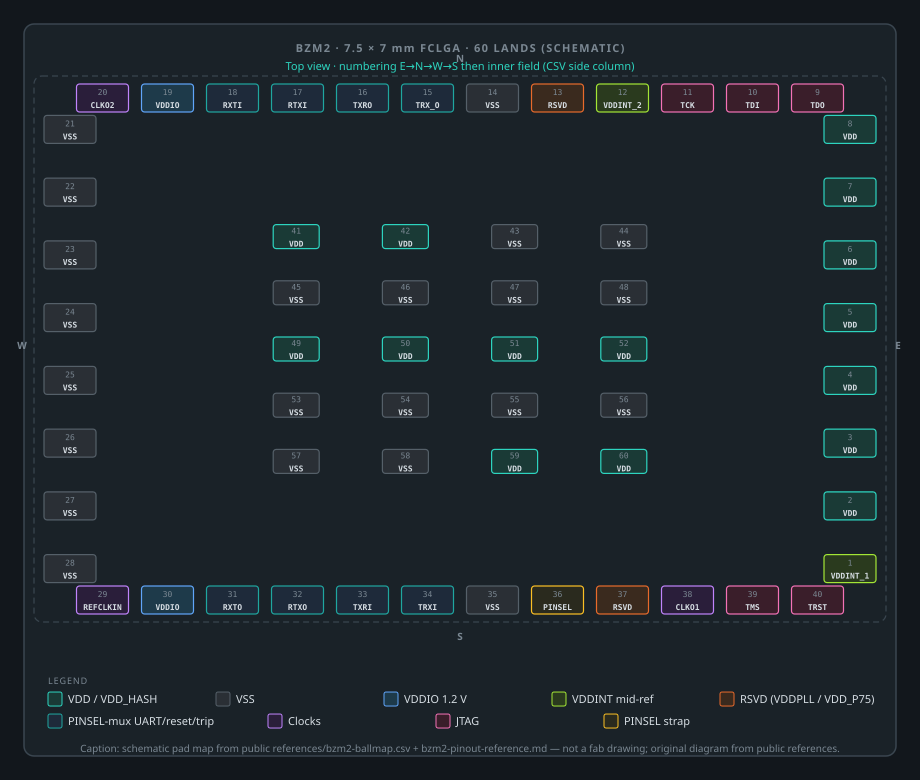

# BZM2 Pinout And Ball Map Reference

Per-pad reference for the BZM2 `7.5 x 7 mm` exposed-die molded FCLGA package:
`40` peripheral LGA pads plus a `20`-pad inner land field, `60` lands total.
The machine-readable version is [`bzm2-ballmap.csv`](bzm2-ballmap.csv).

Pad-for-pad cross-validated against a working single-ASIC board design.
Numbering runs around the periphery (`1-40`: east column, north row, west
column, south row in top view) then the inner field (`41-60`).

## Package pad map

Original schematic generated from [`bzm2-ballmap.csv`](bzm2-ballmap.csv) (source of truth for pad IDs/names). Drawn **to scale** from the land pattern below. Regenerable via [`scripts/generate_padmap_svg.py`](../scripts/generate_padmap_svg.py), which also emits the reference footprint. This is the **PCB land pattern**, not a package drawing — see *Assumptions And Tolerances* before using the figures.

## Rails

| Rail | Pads | Count | Notes |
| --- | --- | --- | --- |
| `VDD` (`VDD_HASH`) | `2-8`, `41-42`, `49-52`, `59-60` | `15` | `0.71 V` nominal; size for `~14 A` stock, `~27 A` maxed - roughly `1-2 A` per pad at the extremes |
| `VSS` | `14`, `21-28`, `35`, `43-48`, `53-58` | `22` | ground return for everything |
| `VDDIO` | `19`, `30` | `2` | `1.2 V` IO rail. We connect **both** pads; whether they are joined on-die is not documented anywhere we can cite, so this is our conservative default rather than a stated requirement - see the [Board Design Guide](bzm2-board-design-guide.md) |
| `VDDINT_1` / `VDDINT_2` | `1`, `12` | `2` | internal stack midpoint (~`0.355 V`) brought out for reference/decoupling - **outputs**, not load rails |
| `VDDPLL` (datasheet: `RSVD`) | `13` | `1` | PLL supply decoupling point in the reference designs |
| `VDD_P75` (datasheet: `RSVD`) | `37` | `1` | `0.75 V` backup rail used if the on-chip LDO path is unavailable |

The datasheet marks pads `13` and `37` as reserved; the vendor architecture
material and the reference board designs treat them as `VDDPLL` and `VDD_P75`
respectively. Follow the reference-design treatment (local decoupling; supply
`VDD_P75` only if your design uses the backup-LDO path).

## Clocks

| Pad | Signal | Direction | Spec |
| --- | --- | --- | --- |
| `29` | `REFCLKIN` | Input, no pull | `<= 50 MHz`; `50 MHz` standard |
| `38` | `REFCLKOUT1` | Output | `< 50 MHz`; ASIC-to-ASIC, muxed in debug mode |
| `20` | `REFCLKOUT2` | Input (no pull) | `< 50 MHz`; ASIC-to-ASIC, muxed in debug mode |

Internal PLLs (one per stack) run `16 MHz` to `3200 MHz`, programmable.

## UART, Reset, And Trip (The PINSEL-Muxed Group)

Eight pads carry the UART / reset / trip chain interface. Their function
depends on the `PINSEL` strap (pad `36`), which exists so a wrap-around board
layout can flip the ASIC orientation without crossing traces:

| Pad | Name | `PINSEL = 0` | `PINSEL = 1` | Default state |
| --- | --- | --- | --- | --- |
| `18` | `RX_TRIP_IN` | `RX_IN` | `TRIP_IN` | input, pull-up |
| `16` | `TX_RESET_OUT` | `TX_OUT` | `RESET_OUT` | output |
| `17` | `RESET_TX_IN` | `RESET_IN` (active low) | `TX_IN` | input, pull-up |
| `15` | `TRIP_RX_OUT` | `TRIP_OUT` | `RX_OUT` | high-Z, pull-down |
| `31` | `RX_TRIP_OUT` | `RX_OUT` | `TRIP_OUT` | high-Z, pull-down |
| `32` | `RESET_TX_OUT` | `RESET_OUT` | `TX_OUT` | output |
| `33` | `TX_RESET_IN` | `TX_IN` | `RESET_IN` | input, pull-up |
| `34` | `TRIP_RX_IN` | `TRIP_IN` | `RX_IN` | high-Z, pull-down |

In a `PINSEL = 0` single-ASIC system: host TX -> pad `18`, host RX <- pad
`16`, reset in on pad `17`, trip out on pad `15`; pads `31-34` are the
chain-forwarding side and may be left for chain expansion. IO buffers default
to drive strength code `4'b0100` (programmable per register).

## Boot / Configuration Straps

| Pad | Signal | Internal default | Strap |
| --- | --- | --- | --- |
| `36` | `PINSEL` | pull-up (reads `1`) | strap to `VSS` for `PINSEL = 0` orientation |

`PINSEL` is the only configuration strap. Reset (`RESET_IN`) is active low
with an internal pull-up.

## Test / DFT

Full JTAG TAP on the periphery: `TDO` (`9`), `TDI` (`10`), `TCK` (`11`),
`TMS` (`39`), `TRST` (`40`). Bring these to a header for validation and
debug; the vendor JTAG collateral covers usage.

## Land Pattern Geometry

The 60 lands sit on a **uniform 0.615 mm pitch**, the same on both axes. There is
no stagger and no irregular spacing: the twelve N and S lands step eleven equal
0.615 mm intervals, and the eight E and W lands step seven.

| | lands | size (w x h) | placement |
| --- | --- | --- | --- |
| E / W columns | 8 each | `0.705 x 0.305 mm` | `x = +/-3.6975`, `y` spans `+/-2.1525` |
| N / S rows | 12 each | `0.305 x 0.935 mm` | `y = +/-3.3325`, `x` spans `+/-3.3825` |
| Inner field | 20 | `0.805 x 0.805 mm` | `x` pitch `1.208`, `y` pitch `1.310 mm` |

All coordinates are relative to the land-field centre, top view, `y` up. Peripheral
lands are elongated **perpendicular to the edge they sit on**.

**The 40 peripheral lands share no corner.** The 12-land rows span the full width
and the 8-land columns sit between them: `12 + 12 + 8 + 8 = 40` distinct
positions. A ring on a 12 x 8 perimeter would have only 36, so treating this as a
ring double-books four lands.

**This is the PCB land pattern, not the package body.** Land extent works out to
`8.100 x 7.600 mm` including land widths, around a `7.5 x 7 mm` package body -- a
land pattern is normally larger than the part that seats on it. Nothing here is a
package drawing, and the vendor's own land dimensions are not stated.

### Provenance

Corroborated against the **public open-source footprint** shipped by
[`bitaxeorg/bitaxeBonanza`](https://github.com/bitaxeorg/bitaxeBonanza) and
[`bitaxeorg/bitaxeBIRDS`](https://github.com/bitaxeorg/bitaxeBIRDS) as
`bitaxe.pretty/bzm2.kicad_mod`. The two are geometrically identical to each other,
and agree with this table to **0.5 um** -- that residue is their rounding to three
decimal places, where the values above are exact (`11 x 0.615 = 6.765`, so the row
half-span is `3.3825` rather than a rounded `3.382` / `3.383`).

A generated reference footprint is at
[`footprints/BZM2.pretty/BZM2-FCLGA60.kicad_mod`](../footprints/BZM2.pretty/BZM2-FCLGA60.kicad_mod),
emitted by [`drawings/gen_padmap.py`](../drawings/gen_padmap.py) from
[`bzm2-ballmap.csv`](bzm2-ballmap.csv) plus the table above. It carries each land's
name and function from the CSV, which neither open-source footprint does. It is
oriented to this document's top-view convention (E to the right), which is 180
degrees from the bitaxeorg parts -- a placement rotation, not a geometry
difference.

### Assumptions And Tolerances

State these before using the figures. They are **nominal centres and sizes with
no tolerance band**, because no tolerance is published anywhere we can cite.

| | |
| --- | --- |
| **Nominal only** | No min/max, no tolerance class. Treat as target geometry, not as limits. |
| **Land pattern, not package** | These are PCB lands. The vendor's own package land dimensions are **not stated in any public source**, and are not these numbers. |
| **Agreement with source** | Max deviation from the public bitaxeorg footprints is **0.5 um**, which is their rounding to 3 dp. |
| **Exact vs rounded** | Where the rounding is recoverable the exact value is used: row half-span `3.3825`, since `11 x 0.615 = 6.765`. The public parts store `-3.382 / +3.383`. |
| **Orientation** | Top view, `+x` east, `+y` north, `y` up. The generated footprint is **180 degrees** from the bitaxeorg parts. A placement rotation, not a geometry difference. |
| **Package body `7.5 x 7 mm`** | Taken from the header of this document. **Not measured**, and not derived from the land pattern. |
| **Courtyard `body + 0.25 mm`** | **Our choice**, not from any source. Change it to suit your own DFM rules. |
| **Paste and mask** | The generated footprint applies KiCad defaults. **No stencil design is implied** - aperture reduction on the inner field in particular is a stencil-house decision. |
| **Corroboration is not independence** | `bitaxeBonanza` and `bitaxeBIRDS` are geometrically identical, so they are **one source, not two**. Confidence rests on one open-source lineage plus our own board, which agrees with it by pure translation. |

**Not verified by us:** that this land pattern reflows correctly, that the inner
field's paste coverage is right, or that any of it matches the vendor's
recommended land pattern. It is what working open-source boards use.

## Everything Else

- **Differential pairs:** none - all single-ended.
- **Analog pads:** none exposed; temperature and voltage sensing are internal
  and read over UART (`DTS_VS`).
- **NC / RESERVED:** pads `13` and `37` only (see the Rails section).
- **Power-up sequencing:** see the bring-up section of the
  [Integration Guide](blockscale-asic-integration-guide.md) - control rails
  and reference clock before stack voltage, ASICs held in reset, stack ramped
  with sensor feedback.
