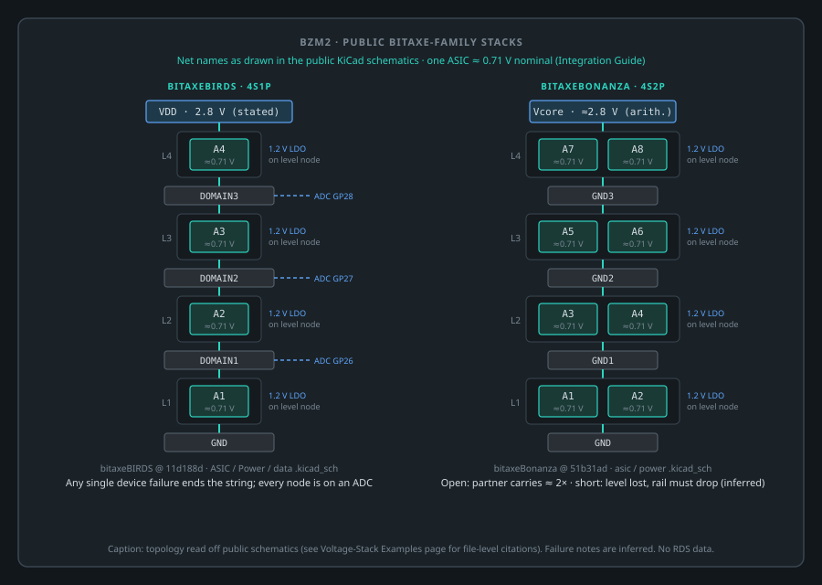
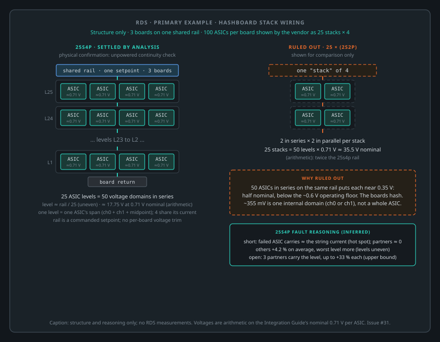

# BZM2 voltage-stack topology examples

Worked examples of how real boards arrange BZM2 ASICs **in series and in parallel on one rail**, and
what each arrangement means for balancing and fault tolerance. This page fills the multi-ASIC gap
noted in the [Integration Guide](blockscale-asic-integration-guide.md#core-rails-and-voltage-architecture)
with examples. It makes no new claim about the silicon.

- **Read this with:** the single-ASIC rail/stack drawing
  ([`single-asic-rail-stack.svg`](../drawings/rails/single-asic-rail-stack.svg)), the
  [voltage sensor channels](blockscale-asic-integration-guide.md#voltage-sensor-channels) table, and the
  [Hardware Implementations Survey](bzm2-hardware-implementations.md).
- **Evidence rules on this page:**
  - every statement about an open-source board is cited to a repository, a commit and a file;
  - anything that cannot be read from a public source is marked **unconfirmed**;
  - failure behaviour is circuit reasoning, not a measurement, and is marked **inferred**;
  - voltages computed from the nominal per-ASIC figure are marked as arithmetic.

## The building block: one ASIC is ~0.71 V across two internal stacks

One BZM2 spans `VDD_HASH` ≈ `0.71 V` nominal (tunable window roughly `0.6-0.81 V`). Internally that span
is split into a bottom and a top engine stack of ≈ `0.355 V` each, with the midpoint brought out on
`VDDINT_1/2` ([Integration Guide, Core Rails](blockscale-asic-integration-guide.md#core-rails-and-voltage-architecture);
[Pinout, Rails](bzm2-pinout-reference.md)).

The voltage sensor reports `ch0` and `ch1` as the differential across the bottom and top stacks
(≈ `355 mV` each on a healthy part), and `ch2` as the midpoint error (≈ `0 mV`)
([voltage sensor channels](blockscale-asic-integration-guide.md#voltage-sensor-channels)). **A single
~355 mV sense reading is half an ASIC, not a whole one.** Keep that in mind when dividing a board rail
by a per-device reading to infer series depth.

## Vocabulary

| term | meaning here |
| --- | --- |
| **series level** | a group of ASICs sharing the same bottom (VSS) and top (VDD) node; levels stack on each other |
| **parallel count (p)** | ASICs per level; they share the level's current |
| **NsMp** | N series levels of M ASICs in parallel; N × M ASICs on one rail |
| **rail** | the single regulated supply across the whole string, ≈ N × per-ASIC voltage |

In a series stack the **same current** flows through every level. Each level's voltage is set by how much
current its members want at that voltage, relative to the other levels. That is why a stacked board has to
keep every level loaded alike (see [Dummy-job use is not optional in stacked systems](blockscale-asic-integration-guide.md#dummy-job-use-is-not-optional-in-stacked-systems)).

## Example 1: bitaxeBIRDS (4s1p)

**Source:** [bitaxeorg/bitaxeBIRDS](https://github.com/bitaxeorg/bitaxeBIRDS) at
[`11d188d`](https://github.com/bitaxeorg/bitaxeBIRDS/tree/11d188de8778dd4a394ca4740a7cc3f722619baf)
(default branch `pico`), CERN-OHL-S-2.0. The README describes it as "an untested prototype"; the
[Hardware Implementations Survey](bzm2-hardware-implementations.md) lists it as working.

| property | value | basis |
| --- | --- | --- |
| ASICs | 4 | [`README.md`](https://github.com/bitaxeorg/bitaxeBIRDS/blob/11d188de8778dd4a394ca4740a7cc3f722619baf/README.md) line 10: "Four Intel BZM2 ASICs, powered in series" |
| series levels × parallel | **4 × 1** | [`ASIC.kicad_sch`](https://github.com/bitaxeorg/bitaxeBIRDS/blob/11d188de8778dd4a394ca4740a7cc3f722619baf/ASIC.kicad_sch) nets: A1 `VSS` = `GND`; A1 `VDD` = `DOMAIN1` = A2 `VSS`; A2 `VDD` = `DOMAIN2` = A3 `VSS`; A3 `VDD` = `DOMAIN3` = A4 `VSS`; A4 `VDD` = `VDD` (regulator output). One ASIC per level |
| rail | one TPS546D24S "tuned for 2.8V output @ 20A" | `README.md` line 16; regulator `U2` TPS546D24 in [`Power.kicad_sch`](https://github.com/bitaxeorg/bitaxeBIRDS/blob/11d188de8778dd4a394ca4740a7cc3f722619baf/Power.kicad_sch) driving net `VDD` |
| per-ASIC voltage | ≈ 0.70 V (2.8 V / 4; arithmetic) | README line 11: "Each BZM2 is nominally 0.7V"; single-chip sweep 0.68-0.81 V in [`doc/specs.md`](https://github.com/bitaxeorg/bitaxeBIRDS/blob/11d188de8778dd4a394ca4740a7cc3f722619baf/doc/specs.md) |
| per-level IO rail | four MCP1824T-1202 1.2 V LDOs (`U6`, `U1`, `U3`, `U4`), each with its `GND` pin on its level's bottom node (`GND`, `DOMAIN1`, `DOMAIN2`, `DOMAIN3`), each output feeding that ASIC's `VDDIO` (`1V2-1`..`1V2-4`) | `ASIC.kicad_sch` |
| per-level sense | the three intermediate nodes `DOMAIN1/2/3` go to Pico 2W ADC inputs `GP26_A0`, `GP27_A1`, `GP28_A2` | [`data.kicad_sch`](https://github.com/bitaxeorg/bitaxeBIRDS/blob/11d188de8778dd4a394ca4740a7cc3f722619baf/data.kicad_sch) |
| balancing hardware | **none found** in the power path: no shunt balancers or per-level regulators on the stack | `ASIC.kicad_sch`, `Power.kicad_sch` (absence on the schematic) |

**Balancing.** The schematic is passive: the four ASICs share the string current and hold balance by being
loaded alike. What the board adds is **observability**: every intermediate node is on an ADC, so a level
drifting off 1/4 of the rail is visible directly. The firmware balancing policy is not part of this
repository and is **unconfirmed** here. Public reference firmware for four-series BZM2 boards bounds the
aggregate rail to 2.1-3.2 V ([`main/device_config.h:142-143`](https://github.com/johnny9/ESP-Miner-Bonanza/blob/474c8bcb7892b7b94496e21b975b14c4a3c575c1/main/device_config.h#L142-L143)
@ `474c8bc`). Per ASIC, it bounds `ch0` and `ch1` independently and treats a large `ch0`/`ch1` spread as a
stack-imbalance fault ([`main/Kconfig.projbuild:207-270`](https://github.com/johnny9/ESP-Miner-Bonanza/blob/474c8bcb7892b7b94496e21b975b14c4a3c575c1/main/Kconfig.projbuild#L207-L270)).

**Failure behaviour (inferred):**
- **Failed short:** the three survivors share the rail, 2.8 / 3 ≈ 0.93 V each, above the ~0.81 V top of the
  window. The rail must come down at once.
- **Failed open:** string current stops, the board stops hashing, and nearly the whole rail can appear across
  the open device.
- **Stops hashing but still conducts:** its current falls, so its level rises and the others fall. That is
  visible on the `DOMAIN` ADCs.

**Fault tolerance:** none by topology. With one ASIC per level, any single device failure ends the string.
The design's strength is that the failure is **observable per level** from the host.

## Related Bitaxe-family example: bitaxeBonanza (4s2p)

**Source:** [bitaxeorg/bitaxeBonanza](https://github.com/bitaxeorg/bitaxeBonanza) at
[`51b31ad`](https://github.com/bitaxeorg/bitaxeBonanza/tree/51b31ad8e6962b76d652d8b956b0495d39725633)
(branch `1001x`). Its README says the design "doesn't work because issue #3 and might never work because issue #4".
Those are the UART level-shifter and 9-bit issues, not the stack. It is included because it is the public
example of **parallel ASICs within a level**.

| property | value | basis |
| --- | --- | --- |
| ASICs | 8 | [`README.md`](https://github.com/bitaxeorg/bitaxeBonanza/blob/51b31ad8e6962b76d652d8b956b0495d39725633/README.md): "Eight Intel BZM2 ASICs" |
| series levels × parallel | **4 × 2** | [`asic.kicad_sch`](https://github.com/bitaxeorg/bitaxeBonanza/blob/51b31ad8e6962b76d652d8b956b0495d39725633/asic.kicad_sch) nets: A1+A2 `VSS` = `GND`, `VDD` = `GND1`; A3+A4 `GND1`→`GND2`; A5+A6 `GND2`→`GND3`; A7+A8 `GND3`→`Vcore` |
| rail | net `Vcore`, fed by two TPS546D24A (`U3`, `U4`) whose inductors (`L1`, `L2`) both land on `Vcore` | [`power.kicad_sch`](https://github.com/bitaxeorg/bitaxeBonanza/blob/51b31ad8e6962b76d652d8b956b0495d39725633/power.kicad_sch) |
| rail voltage | not stated in the repository (**unconfirmed**); ≈ 4 × 0.71 ≈ 2.8 V nominal by arithmetic, the same series depth as bitaxeBIRDS | arithmetic |
| per-level IO rail | MCP1824 1.2 V LDOs with `GND` pins on the level nodes (`U10`→`GND1`, `U9`→`GND2`, `U8`→`GND3`; `U11` and the host-side parts on `GND`) | `asic.kicad_sch` |
| per-level sense | no level nodes found on host ADC pins in `esp32.kicad_sch` (**unconfirmed**; not found, not proven absent) | [`esp32.kicad_sch`](https://github.com/bitaxeorg/bitaxeBonanza/blob/51b31ad8e6962b76d652d8b956b0495d39725633/esp32.kicad_sch) |

**Failure behaviour (inferred):**
- **Short:** takes out both ASICs of its level, and the other three levels rise to ≈ 0.95 V. The rail must come down.
- **Open (one device):** the partner carries the whole level current, about twice its share.

## Example 2: HashBed (16 ASICs, series-stacked)

**Source:** the [Hardware Implementations Survey](bzm2-hardware-implementations.md) only. HashBed's
repository is **private during development**, so nothing below goes beyond what the survey already states.

| property | value | status |
| --- | --- | --- |
| ASICs | 16 | public (survey) |
| stacking | "series-stacked", 3D-printer-heatbed tile form factor | public (survey) |
| host / bridge | RP2040 (PIO) | public (survey) |
| core rail control | "PMBus controller-based core rail" | public (survey) |
| IO | per-bit level translation, native 1.2 V oscillator | public (survey) |
| series levels × parallel | **unconfirmed** (16s1p, 8s2p and 4s4p are all "series-stacked") | not public |
| rail voltage | **unconfirmed**; by arithmetic ≈ 11.4 V if 16s1p, ≈ 5.7 V if 8s2p, ≈ 2.8 V if 4s4p | arithmetic on an unconfirmed topology |
| balancing, per-level sense | **unconfirmed** | not public |

**Failure behaviour and fault tolerance:** cannot be stated until the parallel count is public. The general
pattern (below) applies: with 1 per level, any single device ends the string. With p > 1, a single open is
carried by the partners at p/(p−1) of their share, and a short costs a whole level.

## Example 3: RDS (production system; 3 boards on one rail)

**Source:** structure only. No measurements are published on this page.

- **3 hashboards** on **one shared supply rail** with one setpoint.
- Each board has **100 ASICs**, presented by the vendor telemetry as **25 stacks of 4**.
- Each board's controller **enables or disables** its board; it has no per-board voltage setpoint.

**How the 4 ASICs of a stack are wired is not confirmed on hardware.** Two readings:

| | **Leading reading: 25s4p** | Superseded alternative: 25 × (2s2p) |
| --- | --- | --- |
| series levels × parallel | 25 levels × 4 in parallel | 50 levels × 2 in parallel |
| per-level voltage | one ASIC, ≈ 0.71 V nominal | ≈ 0.71 V per ASIC ⇒ a 2-high stack ≈ 1.42 V |
| rail it implies | 25 × 0.71 ≈ **17.75 V** nominal (arithmetic) | 50 × 0.71 ≈ **35.5 V** nominal (arithmetic) |
| fits the board rail setpoint discussed in [#4](https://github.com/Blockscale-Solutions/bzm2-hwref/issues/4)? | **yes** | no: it is twice that |
| fits only if… | a whole ASIC is ~0.71 V (the reference's figure) | ~355 mV were the whole-device voltage. Per the [sensor channel table](blockscale-asic-integration-guide.md#voltage-sensor-channels), ~355 mV is **one internal stack** |
| status | **leading; unconfirmed** until a non-destructive per-level check on hardware | **superseded; unconfirmed** |

**Balancing (both readings).** All three boards sit on one rail, so the per-level voltage of each board is set
by the rail divided among its levels according to relative current draw. There is no per-level or per-board
voltage actuator; the levers are load (engine enablement, frequency, dummy work) and the one shared rail.
Per-ASIC `ch0`/`ch1`/`ch2` give each device's internal-stack voltages and midpoint error, which is what a
host watches for imbalance.

**Failure behaviour, leading reading 25s4p (inferred; uniform division assumed):**
- **Failed short:** bypasses its whole level, so its 3 partners stop too (4 ASICs lost). The remaining 24 levels
  share the rail: ≈ +4.2 % per level, e.g. 0.71 → ≈ 0.74 V nominal. Two, three and four shorted levels give
  ≈ +8.7 %, +13.6 % and +19 %. By the third or fourth, survivors reach the ~0.81 V window top.
- **Failed open (one device):** its 3 partners carry the level current, about +33 % each if the current holds.
  The board can keep running at a derated string current.
- **Whole level open:** string current stops; that board stops, and the full rail can appear across the gap.
- **Stops hashing, still conducts:** its level's current demand falls and its level voltage rises. Keeping
  it loaded with dummy work, if it still accepts writes, is the balancing tool.

**Superseded 2s2p, for comparison (inferred):** a short collapses one of 50 half-levels (≈ +2 % on the rest),
and an open doubles the single partner's current.

**Fault tolerance.**
- The shared rail means a board-level problem cannot be compensated per board. Lowering the rail for one board
  lowers it for all three.
- Board isolation is enable/disable only.
- Within a board, the 4-wide levels of the leading reading tolerate a single-device open (partners carry it), and
  a single short at a modest overvoltage cost to the rest of the string.

## Comparison

| | bitaxeBIRDS | bitaxeBonanza | HashBed | RDS (leading) | RDS (superseded) |
| --- | --- | --- | --- | --- | --- |
| ASICs on the string | 4 | 8 | 16 | 100 per board, 3 boards on one rail | same |
| series levels × parallel | 4 × 1 | 4 × 2 | **unconfirmed** | 25 × 4 | 50 × 2 |
| rail (nominal) | 2.8 V (stated) | ≈ 2.8 V (arithmetic; unstated) | **unconfirmed** | ≈ 17.75 V (arithmetic) | would need ≈ 35.5 V |
| per-ASIC voltage | ≈ 0.70 V | ≈ 0.71 V | ≈ 0.71 V | ≈ 0.71 V | ≈ 0.71 V |
| per-level IO rail | LDO per level | LDO per level | unconfirmed | not public | not public |
| per-level host sense | yes: 3 ADC nodes | not found | unconfirmed | per-ASIC VS only (public) | same |
| balancing | passive; firmware bounds VS | passive (inferred) | unconfirmed | shared rail; load levers only | same |
| single short (inferred) | survivors ≈ 0.93 V: rail down | level lost; others ≈ 0.95 V: rail down | depends on p | 4 ASICs lost; others +4.2 % | 2 ASICs lost; +2 % |
| single open (inferred) | string stops | partner at ≈ 2× | depends on p | partners +33 % | partner 2× |
| survives one device fault? | no | open: marginal; short: no | unconfirmed | **yes, within limits** (inferred) | open: marginal |

**The pattern:**
- more ASICs in parallel per level make a single open survivable;
- more levels make a single short survivable at a small overvoltage;
- a one-per-level design trades that tolerance for **per-level observability** at low cost.

The limits (window top, partner current) must be characterised on the real board before any firmware relies on
them.

## Gaps

- HashBed topology beyond "16, series-stacked": private until release.
- RDS in-stack wiring: leading reading 25s4p; confirmation needs a non-destructive per-level check on hardware.
- bitaxeBonanza rail setpoint and per-level sense: not found in the public design files.
- Survivable per-level overvoltage and partner overcurrent for any of these boards: unpublished.
