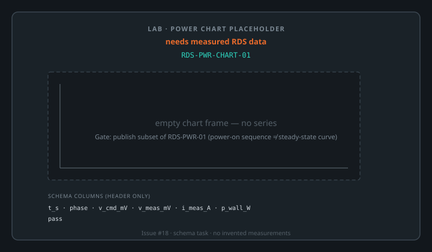
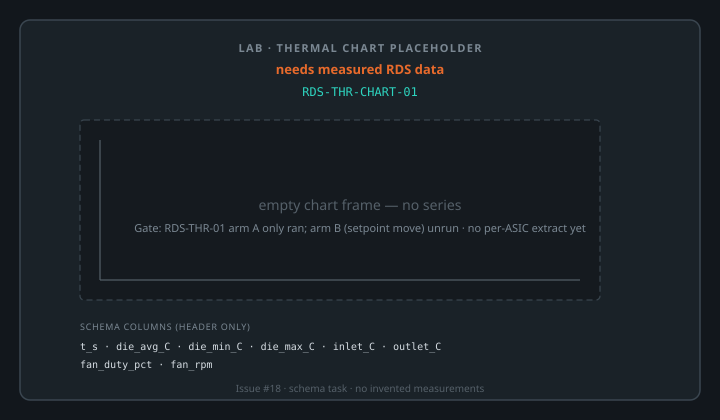
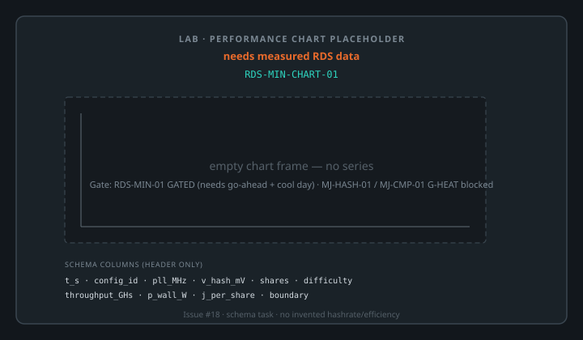

# Lab chart placeholders (RDS measured data only)

## Purpose

Empty chart frames and capture **schemas** for independent lab characterization:
power, thermal, and performance. This is a **schema task** until measured RDS
data is published under project rules.

**Hard rule:** do not invent hashrates, temperatures, power numbers, or
efficiencies. Every figure caption says **needs measured RDS data**.

## Placeholders (shipped)

| Chart | Case id | SVG | Schema CSV |
| --- | --- | --- | --- |
| Power | `RDS-PWR-CHART-01` | [drawings/lab/rds-pwr-chart-placeholder.svg](../drawings/lab/rds-pwr-chart-placeholder.svg) | `site/data/schemas/RDS-PWR-CHART-01.csv` |
| Thermal | `RDS-THR-CHART-01` | [drawings/lab/rds-thr-chart-placeholder.svg](../drawings/lab/rds-thr-chart-placeholder.svg) | `site/data/schemas/RDS-THR-CHART-01.csv` |
| Performance | `RDS-MIN-CHART-01` | [drawings/lab/rds-min-chart-placeholder.svg](../drawings/lab/rds-min-chart-placeholder.svg) | `site/data/schemas/RDS-MIN-CHART-01.csv` |

### Power

Caption: **needs measured RDS data**. Intended fill from a publish decision on
`RDS-PWR-01` (power-on sequence capture today — not a steady-state curve).

### Thermal

Caption: **needs measured RDS data**. `RDS-THR-01` arm A only; arm B unrun; no
per-ASIC thermal series extracted yet.

### Performance

Caption: **needs measured RDS data**. `RDS-MIN-01` gated (needs explicit
go-ahead and a cool day). Related gated cases: `RDS-FLU-01`, `MJ-HASH-01`,
`MJ-CMP-01` (G-HEAT).

## Proposed capture schemas

| Chart | Case id | Columns |
| --- | --- | --- |
| Power | `RDS-PWR-CHART-01` | `t_s`, `phase`, `v_cmd_mV`, `v_meas_mV`, `i_meas_A`, `p_wall_W`, `pass` |
| Thermal | `RDS-THR-CHART-01` | `t_s`, `die_avg_C`, `die_min_C`, `die_max_C`, `inlet_C`, `outlet_C`, `fan_duty_pct`, `fan_rpm` |
| Performance | `RDS-MIN-CHART-01` | `t_s`, `config_id`, `pll_MHz`, `v_hash_mV`, `shares`, `difficulty`, `throughput_GHs`, `p_wall_W`, `j_per_share`, `boundary` |

Header-only CSV files live under `site/data/schemas/`. **No data rows.**

## Already-public wall-power note (not a chart)

Public test-case index text for `RDS-MIN-01` states *3,248 W mining against
339 W powered-idle* — two wall-power figures with **no hashrate attached**.
Usable as prose context only; **do not** pair with an unmeasured hashrate to
derive efficiency on these placeholders.

## Measured fill (later)

- Explicit publish decision per metric column before any numbers go public
- CSV committed with case id + date + config + measurement boundary
- Plot from CSV only — no invented series
- Measured-vs-derived / vendor-firmware-reported sorting is a human per-figure
  call (same class of problem as the internal claim ledger)

## Provenance

Coordinate with Mujina BZM2 integration publishing rules. Issue #18.
